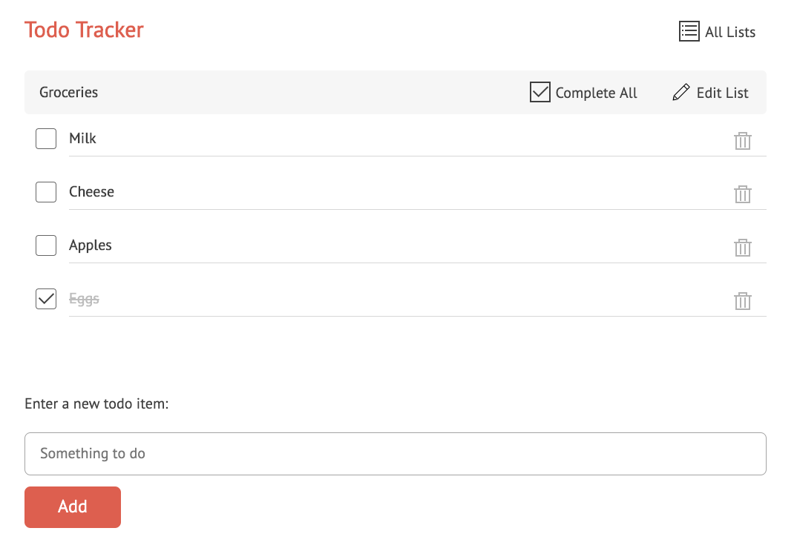
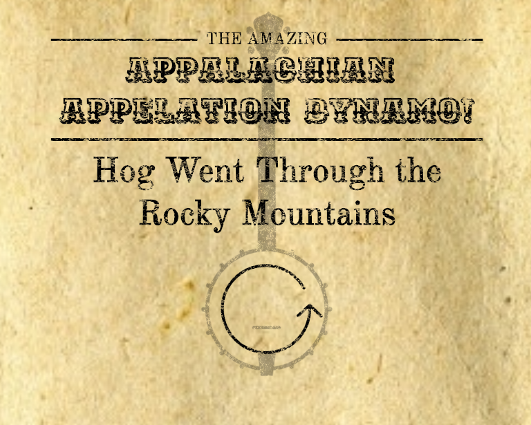

## Portfolio

---

### Ruby Projects 

- ### [Check Yourself](ben-harvey.github.io/check-yourself)
  #### a checkbox-based drum machine
  

- ### [Todos Tracker](ben-harvey.github.io/todos)
  #### a web-based personal task manager
  

### Python Projects 

  - ### [Appalachian Appelation Dynamo](ben-harvey.github.io/aad)
    #### a Markov chain generator for fiddle tune names
    
