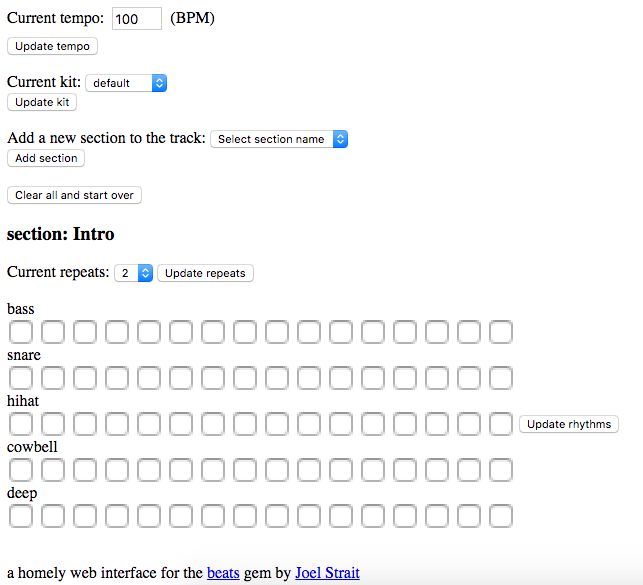

## A homely, checkbox-based drum machine 

### Try the [live app](https://check-yourself.herokuapp.com/)

Check yourself is a web-based drum-machine interface, built on top of the [Beats](https://github.com/jstrait/beats) gem.
Written in Ruby using Sinatra. 

Here's how to play:

- Each instrument has its own rhythm, represented by a horizontal row of checkboxes.
- Each checkbox in the row corresponds to a 16th note in that instrument's rhythm.
- Click the checkboxes for one or more instruments to build some rhythms.
- Then, click the 'Update rhythms' button to the right of the checkboxes to hear your track!

You can also:

- add variety to your track by adding a new section (it appears at the bottom of the screen)
- change the tempo or the drum kit for your track
- start over and view these instructions again

Have fun!
